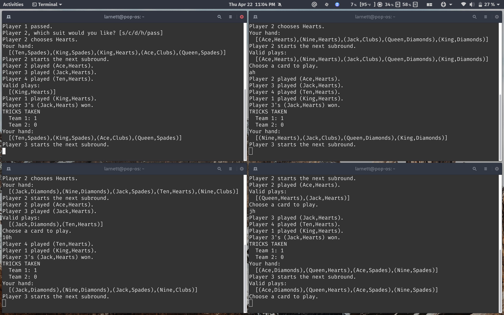

# Euchre Server

Server for 4-player [Euchre](https://bicyclecards.com/how-to-play/euchre/), built on Haskell's `Network.Socket`.



## Usage

### Start the server:
``` sh
cabal run euchre-server
```

### Connect as client:
``` sh
telnet localhost 4242
```

Game begins after 4 connections are successfully made.

### Acceptable card input:

``` sh
a h # ace of hearts
cj  # jack of clubs
qd  # queen of diamonds
10s # 10 of spades
...
etc
```

`s d c h` -> spades, diamonds, clubs, hearts

`9 10 j q k a` -> 9, 10, jack, queen, king, ace

### Each round:
 - [x] deal cards
 - [x] "turn over" top card
 - [x] choose trump suit 
   -  [x] if top card selected, dealer chooses a card to give up and receives top card
   -  [x] if not, each player gets a chance to choose a suit or pass
   -  [ ] opportunity to call loner
 - [x] 5 trick taking subrounds:
   -  [x] leader starts
   -  [x] highest card player wins the subround
   -  [x] next leader = highest card player
 - [x] team with most tricks taken wins the round
   -  [x] 1 point if their team called it
   -  [x] 2 points if the other team called it
   -  [ ] 4 points if loner


